# WEEK_1
This is my first internship repository.

i have built multiple projects like and their solution screen shots are listed below.

##Calculator

This was my fist task.I built a simple calculator which can do simple calculations.

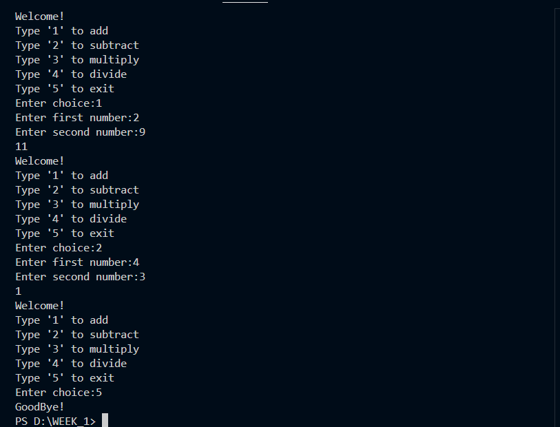

##Even Odd checker

This script checks whether a number is an odd or even number.

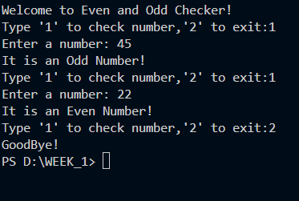

##Factorial Calculator

This calculator calculates a factorial of any number

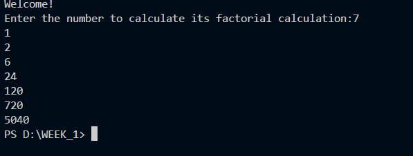

##Fibonacci series

This scripts gives the fibonacci series

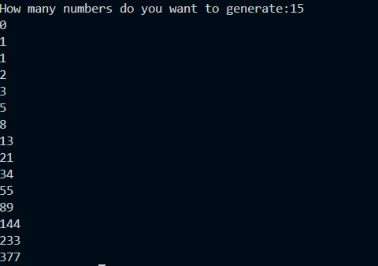

##Student marks average calculator

This script calculate the average and total marks of the student

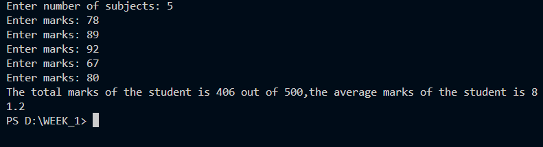

##Simple login system

This script is a simple login system.It first registers you as a user and then you have to login.

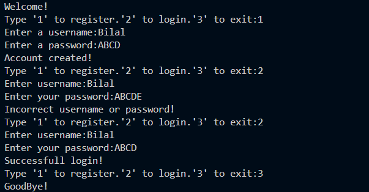

##Largest number in a list

This script first asks you for numbers in a list and then tell you the largest number in the list

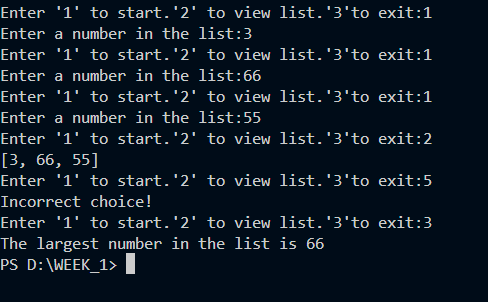

##Reverse a string

This script reverses a string by first asking you a sentence and then reversing the sentence.

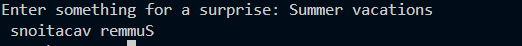

##Counting vowel

This script counts the number of vowels in the sentence.It first asks you for a sentence and then counts the vowels.

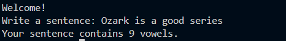

##Remove duplicate from a list

This scripts ask the user for item to put inside the list and then make a new list after removing any duplicates.

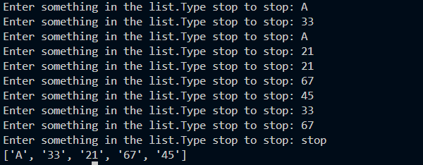

##Pattern printing

This script asks the user for a number and then print a pattern according to the number.

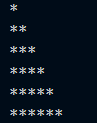

##Project

This is my first project.The name of the project is Student managment system.

#Features
.Adding a student.
.Viewing all student information.
.Viewing a single student information.
.Updating a student's information.
.Deleteing a student's information

#Adding a student.

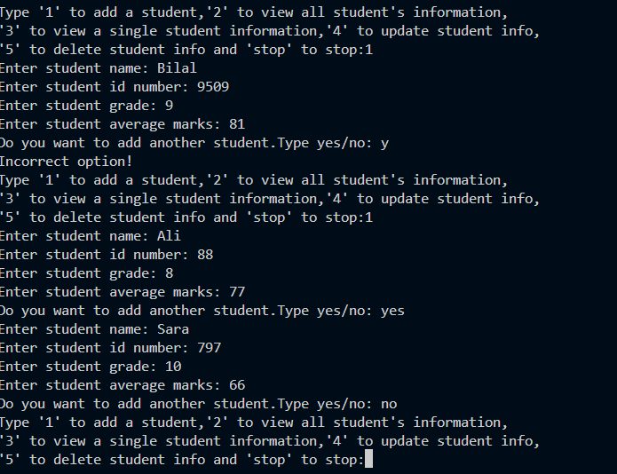

#Viewing all students information

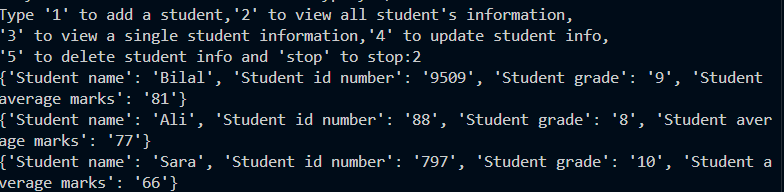

#Viewing a single student information

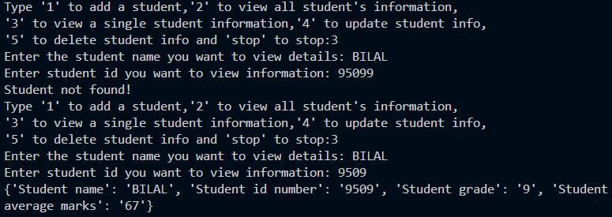

#Updating information

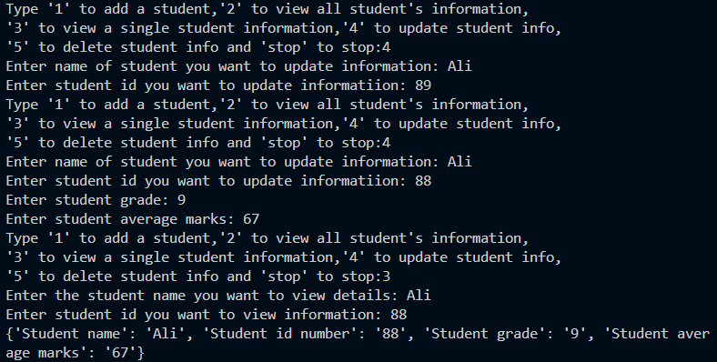

#Deleting student's information

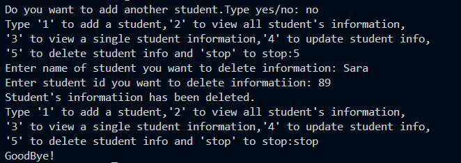
